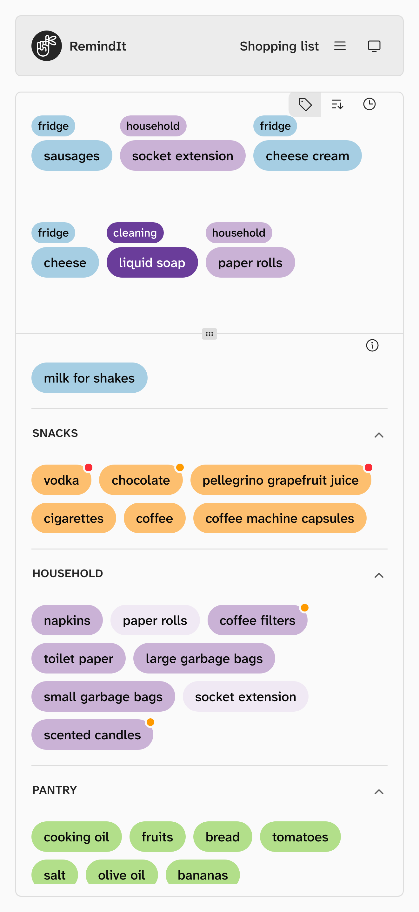
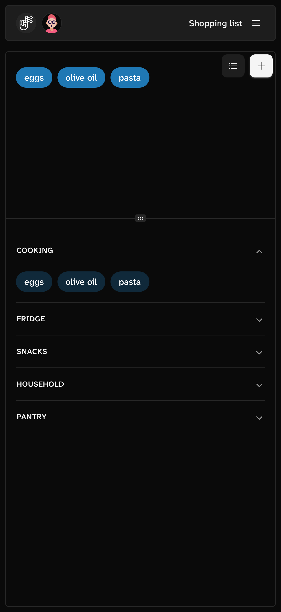

# remindit-app-pwa

**Live app: [remindit.parsedwink.com](https://remindit.parsedwink.com)**

This project is a Progressive Web App (PWA) to manage a personal shopping list.

- [docs/ROADMAP.md](docs/ROADMAP.md) roadmap

| Light | Dark |
| --- | --- |
|  |  |

## Documentation

- [DESIGN.md](DESIGN.md) design system (contributors)
- [AGENTS.md](AGENTS.md) agents instructions
- [docs/DEV.md](docs/DEV.md) development & state architecture
- [docs/DEV-COMPONENTS.md](docs/DEV-COMPONENTS.md) Shark UI registry vs custom split
- [docs/DEMOS.md](docs/DEMOS.md) demo video generator (scenarios, gotchas, release flow)
- [docs/DEPLOY.md](docs/DEPLOY.md) deployment
